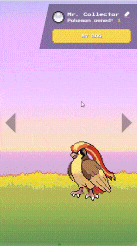

# Poke Game


A simple pokemon game with nintendo vibes :)

Stacks:
- [React](https://reactjs.org/)
- [Apollo GraphQL](https://www.apollographql.com/docs/react/)
- [CSS-in-JS Emotion](https://emotion.sh/)
- [Jest](https://jestjs.io/) & [React Testing Library](https://testing-library.com/)

Here's the [demo](https://pokegame-by-andara.web.app/)
- - -

## Project setup
- Install dependencies in the local
  ```
  npm install
  ```

- Create .env.local and set env variables with this value (or simply set in .env file)
  ```
  REACT_APP_BASE_API=https://graphql-pokeapi.vercel.app/api/graphql
  ```
### Compiles and hot-reloads for development
  ```
  npm run start
  ```
### Launches the test runner in the interactive watch mode
```
npm run test
```
### Compiles and minifies for production
```
npm run build
```

- - -
## Work to do

- Add integration test
- Virtualized pokemon list

- - -
## Credits

[graphql-pokeapi](https://github.com/mazipan/graphql-pokeapi)
